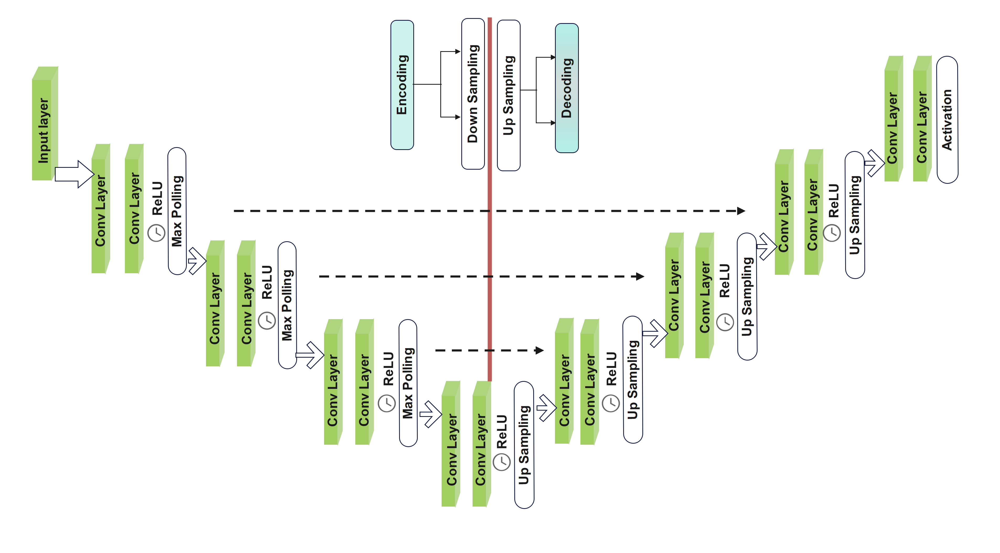
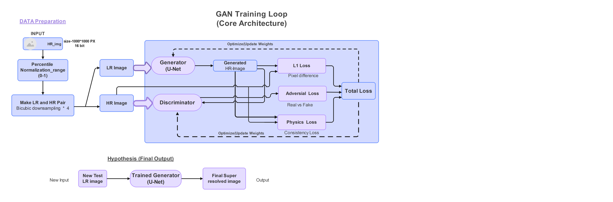
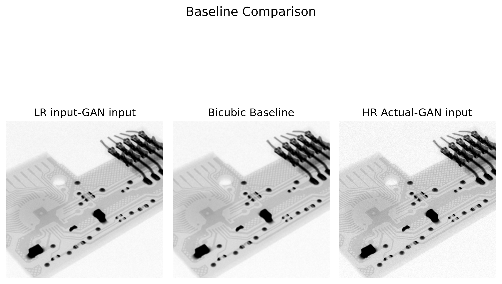
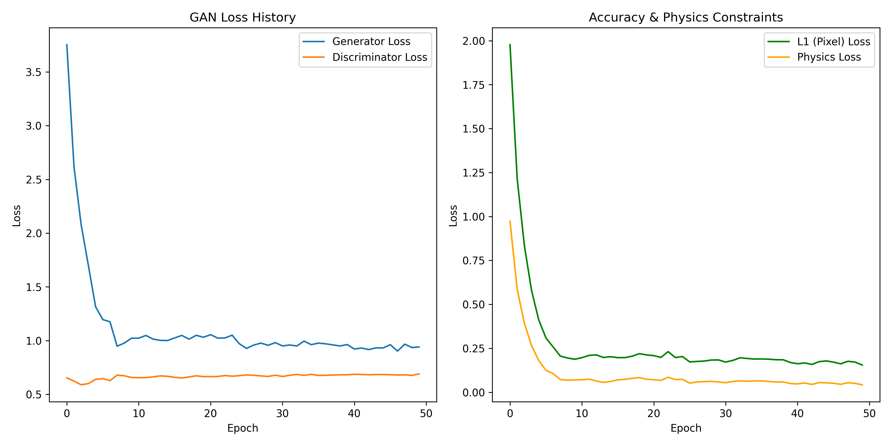

# Trustworthy Few-Shot GAN for PCB X-Ray Image Reconstruction

[cite] indicating Notebook lines.

[cite_start]This project implements a **Few-Shot Generative Adversarial Network (GAN)** framework specifically designed for high-resolution PCB X-ray image reconstruction[cite: 5]. [cite_start]It addresses critical challenges in industrial imaging, such as limited training data and artifacts like "missing cone" streaking[cite: 4, 5].

# Dataset Name
PCB X-ray Laminography Dataset.Source: Zenodo (Records 17084482) (https://zenodo.org/records/17084482). Total Images in Source: 759 images in TIF format.Few-Shot Configuration: Out of the total 759 images, only 50 images were utilized for this research to simulate a few-shot learning scenario.Data Split: 40 images for training and 10 images for testing/evaluation

## 🌟 Key Innovations
* [cite_start]**Few-Shot Strategy:** Efficiently trained on only **40 images** while maintaining high reconstruction quality[cite: 5, 27, 105].
* [cite_start]**Trustworthiness:** Incorporates **Physics-based constraints (Physics_loss)** to ensure consistency and reduce hallucinations[cite: 6].
* **Dynamic Range Solution:** Implements **Percentile-based normalization (2nd-98th percentile)** to handle low-dynamic-range (uint16) X-ray data[cite: 69, 130].

## 🏗️ Architecture
The model uses a **U-Net** based generator for its superior skip connections and spatial detail retention[cite: 258, 259].

 





## 📊 Performance Analysis
[cite_start]We compared our model against a **Bicubic Interpolation** baseline[cite: 71, 172].

### [cite_start]Quantitative Results[cite: 232, 255]:
| Metric | Baseline (Bicubic) |
| :--- | :--- |
| **Average PSNR** | 33.70 dB |
| **Average SSIM** | 0.8278 |

### Visual Comparison

*Visualizing LR vs Baseline vs HR Actual. [cite_start]Our GAN aims to restore sharp borders and clear details[cite: 251, 252].*

### Training Progress

*Loss curves showing the stability of Adversarial and Physics-based losses during training.*
## 🛠️ Installation & Usage
1. Clone the repository:
   ```bash
   git clone (https://github.com/Imon39/Trustworthy-FewShot-GAN-PCB-Xray.git)
